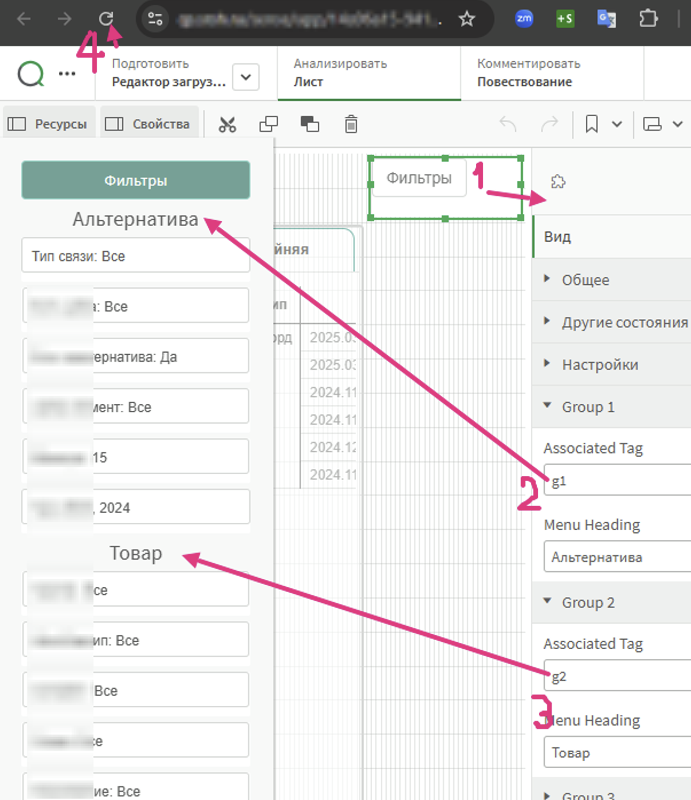

Hello! 
This is about the <b>extention for Qlik Sense</b>, for UI|UX elements like a display|hide <b>vertical side menu</b> for using saved filter objects (filtering fields of loaded datamodel).

Original repo of qs-side-menu is there: [https://github.com/LorisLombardo87/qs-side-menu]

Here is a clone of one of original versions with some <b>local changes</b>.
It was done quickly, may have errors or troubles... If you want to use it, so be sure that you use it as is, without any "garanty or warranty" or any other obligations|regulations.
  
Anyway, my task was solved quickly and it works in my environment without any errors.
  
Thank you.

 
 
 
 
 
